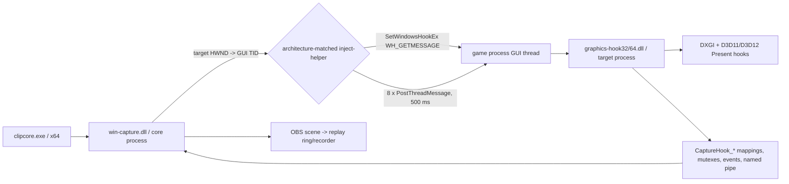

# Shard OBS Game Capture Compatibility Audit

Audit date: 2026-08-16

## Conclusion

Shard now exercises the real OBS compatibility injection path successfully against ordinary x64 D3D11, x64 D3D12, and x86 D3D11 targets, including genuinely minimized windows. The compatibility path is not a direct `CreateRemoteThread` injector: it installs a thread-specific `WH_GETMESSAGE` hook from the architecture-matched helper and posts eight messages at 500 ms intervals.

VRChat was tested through `start_protected_game.exe` while `EasyAntiCheat_EOS.exe` was running and SteamVR reported an initialized Valve Index. The last successful injection stage was:

```text
SetWindowsHookEx(WH_GETMESSAGE) succeeded
PostThreadMessage succeeded repeatedly for the selected VRChat GUI thread
```

The first stage that never occurred was:

```text
TargetDllLoad
```

No target-side mutex, `HookInfo`, event, pipe, graphics API, swapchain, shared texture, or first-frame checkpoint appeared. This is narrower than “EAC blocked capture”: Windows accepted the hook installation and the target thread accepted posted messages, but the hook DLL never became observable inside VRChat. The evidence is consistent with EAC preventing or neutralizing the ordinary unsigned OBS-compatible DLL load, but it does not identify EAC's internal policy or prove whether the callback was suppressed before loader entry versus a load being immediately rejected.

## A. Architecture summary

### Before this audit

Shard already embedded OBS Studio 32.2.1 and created two sources for a game subject:

1. `window_capture` using WGC, rendered above the other source.
2. OBS `game_capture`, configured with `anti_cheat_hook=true`, rendered below WGC.

The active in-process path was OBS's own compatibility path from the vendored `win-capture` plugin, not a Shard-specific injector and not Medal code.



Participating binaries and locations:

| Component | Runs in | Responsibility |
|---|---|---|
| `clipcore.exe` | Shard process | OBS lifecycle, scene, WGC/Game Capture layering, replay ring |
| `win-capture.dll` | Shard process | Target selection, architecture detection, helper launch, IPC client, texture import |
| `inject-helper64.exe` | Separate x64 helper | Loads the hook DLL as an HMODULE, resolves `dummy_debug_proc`, installs the x64 message hook |
| `inject-helper32.exe` | Separate x86 helper | Equivalent path for x86 targets |
| `graphics-hook64.dll` | Target x64 game | Detects graphics API/swapchain, hooks Present/ResizeBuffers, publishes frames |
| `graphics-hook32.dll` | Target x86 game | Equivalent path for x86 targets |
| `window_capture` source | Shard process | Normal WGC path while the target window is not minimized |

Hook and helper sources are under `vendor/obs-studio/plugins/win-capture/`; the shared injection implementation is under `vendor/obs-studio/shared/obs-inject-library/`. The audited vendored OBS revision is `0052d024` (OBS 32.2.1).

### Injection selection

`core/src/sources.cpp` sets `anti_cheat_hook=true` on the OBS `game_capture` source. Consequently:

- Shard normally chooses OBS's compatibility helper path for the game source.
- `GetWindowThreadProcessId` obtains the TID from OBS's matched target HWND.
- The helper calls `SetWindowsHookExW(WH_GETMESSAGE, dummy_debug_proc, hook_module, target_tid)`.
- The helper posts `WM_USER + 432` eight times, waiting 500 ms before each post.
- It unhooks only after the post sequence, then exits.
- It does **not** always use direct DLL injection.

OBS's direct path remains present for configurations where architecture matches and anti-cheat mode is disabled. It uses the broader process rights needed by that separate injection mechanism; Shard's configured compatibility path does not take that branch.

### Window and thread selection

OBS selects a window matching the configured executable/title/class and derives the thread from that exact HWND. It does not select the first process thread. Shard's game session layer independently enumerates visible top-level windows for process/session metadata, while the OBS source performs the final capture-window match.

Observed diagnostics include HWND, PID, TID, selection method, visibility, minimized state, and every posted-message result. The ordinary fixtures and VRChat all accepted the posted messages, so no evidence points to a missing message queue or wrong VRChat GUI thread in the tested run.

### IPC and first-frame sequence

The instrumented success path is:

1. `TargetWindow`
2. `TargetArchitecture`
3. `PipeServer`
4. `ResolvedPaths`
5. `HelperArchitecture`
6. `HookDllArchitecture`
7. `HelperLaunch`
8. `HelperStarted`
9. `HelperHookDllLoad` (DLL loaded into helper for callback address)
10. `HelperHookCallbackResolve`
11. `SetWindowsHookEx`
12. `PostThreadMessage` attempts
13. `TargetDllLoad` (inferred from target-owned texture mutexes becoming openable)
14. `HookInfo`
15. `IpcEvents`
16. `HookInitializeSignal`
17. `TargetHookInitialized` / named pipe connected
18. `GraphicsHookInstalled`
19. `GraphicsApiDetected` / swapchain identified
20. `SharedTextureCreated`
21. `HookReadySignal`
22. `FirstFrameCopied`
23. `HookReady` observed by Shard
24. `FrameImport`

Every diagnostic uses monotonic `ts_ms`; relevant records carry PID/TID, path, architecture, Win32 error, dimensions, handle, or API data. Hook-side records are relayed through the existing capture pipe once the target reaches pipe initialization. Before that point, target DLL entry is necessarily inferred from the target-created mutex/IPC objects.

## B. Comparison with current OBS

The vendored implementation and current upstream OBS use the same high-level split:

- matching architecture plus normal/direct mode: direct injection;
- compatibility/anti-cheat mode, or cross-architecture target: architecture-specific helper;
- compatibility helper: target GUI TID, `WH_GETMESSAGE`, repeated `PostThreadMessage`, then unhook and exit;
- target hook: OBS `CaptureHook_*` shared mappings, mutexes, events, pipe, and shared D3D texture transport.

Meaningful Shard divergences before/found during the audit:

| Area | Before/finding | Upstream behavior | Resolution |
|---|---|---|---|
| Source strategy | Shard layers WGC over `game_capture` | OBS Studio exposes sources separately | Retained; WGC remains normal first choice |
| Capture mode | Shard forces `anti_cheat_hook=true` | OBS lets the source setting choose direct vs compatibility | Retained intentionally for fallback compatibility |
| Hook path | Hook DLL could resolve to the shared `%ProgramData%\\obs-studio-hook` copy | OBS manages this as one installation/versioned deployment | Changed to Shard's staged, app-owned hook path |
| Equal-version collision | Another OBS installation's same-version DLL could be reused silently | Safe for a single OBS installation, unsafe for an embedded equal-version fork | Eliminated; ProgramData remains only for Vulkan implicit-layer registration |
| Minimized layering | WGC scene item could remain above a healthy injected texture while WGC stopped updating | Separate OBS sources avoid this composite-layer issue | Hide WGC exactly while the subject HWND is iconic; reveal injected source |
| Architecture failure | `IsWow64Process` failure could effectively become a wrong architecture choice | Correct pairing is required | Detection now fails explicitly; helper and DLL PE headers are validated |
| Diagnostics | Mostly generic OBS warnings | Upstream has useful logs but not Shard's requested end-to-end timeline | Added opt-in cross-process structured timeline |

No replacement injection design was invented. Changes extend the publicly licensed OBS implementation already vendored by Shard.

## C. Root causes and risk ranking

### 1. Shared ProgramData hook collision — fixed

**Likelihood:** high for ordinary/minimized Game Capture on machines with OBS installed; indirect for EAC.

Before the fix, diagnostics resolved the hook to:

```text
C:\ProgramData\obs-studio-hook\graphics-hook64.dll
```

OBS refreshes that shared copy by public hook version. Shard and another OBS installation can have the same version while carrying different builds, so Shard could silently inject a stale or incompatible binary. Shard now resolves and validates its own staged DLL:

```text
<core-bin>\data\obs-plugins\win-capture\graphics-hook32.dll
<core-bin>\data\obs-plugins\win-capture\graphics-hook64.dll
```

### 2. WGC obscured minimized Game Capture — fixed

**Likelihood:** high for true minimized capture; none for helper injection itself.

WGC is above the injected source in the scene. On minimization WGC ceases producing useful frames, but a stale/blank WGC layer could still cover the healthy injected texture. The watchdog now detects the actual subject HWND's iconic state, hides only the WGC scene item while minimized, and restores it on unminimize. Capture health accepts either backend, but accepts WGC only while the window is not minimized.

### 3. Architecture failures could be silent — fixed

**Likelihood:** medium for x64 Shard -> x86 games; low after validation.

Target architecture queries now fail closed rather than silently selecting the wrong helper. The selected helper EXE and hook DLL are checked as canonical absolute paths and their PE machine types must match the target.

### 4. Missing stage-level diagnostics — fixed

**Likelihood:** did not directly break capture, but made all prior failure reports ambiguous.

The new mode distinguished a successful Windows hook installation from a target DLL load. This is what localized the VRChat failure.

### 5. VRChat protected-process policy/trust — unresolved external blocker

**Likelihood:** high for this VRChat/EAC run.

The same Shard-owned compatibility binaries completed the full pipeline on x64 D3D11, x64 D3D12, and x86 D3D11 fixtures. With EAC active, VRChat accepted hook installation and messages but never exposed target-side DLL/IPC state. Shard's hook and helper are unsigned; no signing step exists in `core/CMakeLists.txt`, `scripts/build.ps1`, or the vendored hook/helper targets. This makes trust/allowlisting a probable differentiator from Medal, but the audit did not inspect or bypass EAC policy and does not claim signature alone is sufficient.

### Findings that were not bugs

- The selected compatibility TID comes from the matched target HWND, not the first process thread.
- Eight delayed message posts keep the helper alive long enough on the tested ordinary targets.
- The compatibility path's capture-side `OpenProcess` uses query/synchronization rights; the broad `PROCESS_ALL_ACCESS` call remains confined to OBS's distinct direct-injection path.
- Named IPC identifiers include the target PID and use OBS's existing security descriptors.
- x86 and x64 helpers/hooks are both built and staged.

## D. Changes made

| File | Change |
|---|---|
| `core/src/main.cpp` | Added opt-in OBS log interception that relays Game Capture diagnostics to stderr without changing the `PORT`-first stdout contract |
| `core/src/sources.h` | Added minimized-window/WGC-layer state |
| `core/src/sources.cpp` | Enabled diagnostics setting; hides WGC only on true minimization; treats WGC as healthy only while visible |
| `core/CMakeLists.txt` | Added excluded-from-default-build D3D11 and D3D12 fixture targets |
| `core/tests/gc_d3d11_fixture.cpp` | Added animated x64/x86 D3D11 swapchain target |
| `core/tests/gc_d3d12_fixture.cpp` | Added animated D3D12 swapchain target |
| `scripts/game-capture-test.mjs` | Added four-state frame-hash smoke test, API/architecture/external-target selection, and expected-block diagnostics mode |
| `vendor/obs-studio/plugins/win-capture/game-capture-file-init.c` | Uses Shard's staged app-owned hook DLL instead of shared ProgramData injection copy |
| `vendor/obs-studio/plugins/win-capture/game-capture.c` | Added stage logging, explicit architecture failure, PE architecture/path validation, helper/IPC/frame-import checkpoints |
| `vendor/obs-studio/plugins/win-capture/inject-helper/inject-helper.c` | Added opt-in helper lifecycle and result diagnostics |
| `vendor/obs-studio/shared/obs-inject-library/inject-library.h` | Added diagnostic toggle API |
| `vendor/obs-studio/shared/obs-inject-library/inject-library.c` | Added `SetWindowsHookEx` and per-message result/error checkpoints |
| `vendor/obs-studio/shared/obs-hook-config/graphics-hook-info.h` | Reused reserved ABI space for Shard's diagnostic flag; retained the 648-byte ABI size |
| `vendor/obs-studio/plugins/win-capture/graphics-hook/graphics-hook.c` | Added graphics-hook install, shared transport, and ready checkpoints |
| `vendor/obs-studio/plugins/win-capture/graphics-hook/d3d11-capture.cpp` | Added D3D11 swapchain detection and first-copy checkpoints |
| `vendor/obs-studio/plugins/win-capture/graphics-hook/d3d12-capture.cpp` | Added D3D12 swapchain detection and first-copy checkpoints |

All OBS-derived modifications remain in the GPL-2.0 licensed vendored source. No Medal binary, implementation, identifier impersonation, kernel component, EAC bypass, VRChat patch, elevated execution, or weakened security setting was used.

## E. Test results

Frame freshness is based on decoding saved MP4 video at 10 FPS and counting frame MD5s, not on source dimensions or repeated timestamps alone.

| Target | Process arch | API | Focused | Unfocused | Covered | Minimized | Hook loaded | Fresh frames |
|---|---:|---|---:|---:|---:|---:|---:|---:|
| Shard animated fixture | x64 | D3D11 | 33/33 | 34/34 | 42/42 | 31/31 | Yes | Yes |
| Shard animated fixture | x64 | D3D12 | 32/32 | 32/32 | 40/40 | 49/49 | Yes | Yes |
| Shard animated fixture | x86 | D3D11 | 32/32 | 32/32 | 40/40 | 49/49 | Yes | Yes |
| VRChat + EAC + SteamVR | x64 | D3D11 mirror | Passed threshold | Passed threshold | 2/45 in sampled clip | No injected backend | No | No while truly minimized |

Each `N/N` cell is `unique frames / decoded frames`. The VRChat covered sample was visually/static-hash inconclusive for WGC because the VR mirror scene itself had little change; it does not alter the injection result. The true-minimized diagnostic independently confirmed `IsIconic=true`, `WindowLayer minimized=true wgc_visible=false`, and no injected source initialization.

Additional gates:

- `powershell -File scripts/build.ps1 -SkipApp`: passed; staged 768 files / 391.4 MB.
- `clipcore.exe --selftest`: passed, playable 3.70 s MP4.
- `powershell -File scripts/e2e.ps1`: passed; 60 s save reported 61.71 s and ffprobe reported 61.717333 s; settings/audio/games/ring/shutdown contracts passed.

## F. VRChat/EAC result

Observed environment:

- `VRChat.exe` PID 29740, x64.
- `EasyAntiCheat_EOS.exe` PID 17660 running concurrently.
- VRChat runtime log: `StartVRSDK: OpenVRLoader` and `SteamVR Initialized ... Valve Index`.
- Selected target HWND `0x6017B2`, GUI TID 9576.
- True minimization observed by both the control script and Shard.

Representative sequence:

```text
stage=TargetWindow ... pid=29740 tid=9576 ... minimized=true
stage=TargetArchitecture shard=x64 target=x64
stage=ResolvedPaths helper="...inject-helper64.exe" hook="...graphics-hook64.dll"
stage=HelperArchitecture result=success arch=x64
stage=HookDllArchitecture result=success arch=x64
stage=HelperLaunch result=success mode=compatibility target_tid=9576
stage=HelperHookDllLoad result=1 error=0
stage=HelperHookCallbackResolve result=1 error=0
stage=SetWindowsHookEx result=1 error=0
stage=PostThreadMessage attempt=1 result=1 error=0
...
stage=WindowLayer minimized=true wgc_visible=false pid=29740
```

Absent throughout repeated attempts:

```text
stage=TargetDllLoad
stage=HookInfo
stage=IpcEvents
stage=TargetHookInitialized
stage=GraphicsApiDetected
stage=SharedTextureCreated
stage=FirstFrameCopied
stage=FrameImport
```

**Exact last successful stage:** posted messages were accepted by the target GUI thread after a successful `WH_GETMESSAGE` installation.

**Exact first missing stage:** the target-side graphics-hook DLL load/initialization never became observable (`TargetDllLoad`).

## G. Remaining blockers

### Shard bugs

No remaining Shard implementation bug was reproduced in the ordinary D3D11/D3D12/x86/x64 compatibility path. A low-priority operational issue remains: a protected target that never loads the hook causes periodic helper retries and verbose diagnostics. This is failure handling/noise, not the capture blocker.

### Limitations inherited from OBS

- WGC cannot provide fresh frames for a genuinely minimized VRChat window.
- OBS's compatibility mechanism depends on Windows delivering a message hook callback and loading a user-mode DLL into the target.
- `SetWindowsHookEx` success only proves hook registration, not that a protected target executed the callback or retained the module.
- Target process attach cannot emit pipe diagnostics until enough target-side initialization has succeeded; the earliest load checkpoint is inferred from created IPC mutexes.

### Probable anti-cheat trust/signing issue

The observed boundary is consistent with EAC declining or neutralizing Shard's unsigned hook before target initialization. Medal's signed, vendor-trusted behavior is provenance evidence only. Reusing Medal's binary or trust is explicitly out of scope and was not attempted.

A legitimate next step is vendor engagement: provide the minimal Shard helper/hook hashes, GPL source/build provenance, the diagnostic timeline above, and request an approved capture-tool integration or allowlisting process from VRChat/EAC. Ordinary Authenticode signing may improve provenance but must not be presented as guaranteed EAC acceptance without vendor confirmation.

### Unknowns requiring further investigation

- Whether VRChat's GUI thread callback is suppressed before loader invocation or the DLL is rejected/unloaded before creating the first mutex. Determining this inside EAC without vendor-supported telemetry would cross the audit's anti-tamper boundary.
- Whether EAC offers a documented capture-plugin registration/allowlisting program suitable for open-source builds.
- Whether a reproducible, project-controlled signing pipeline plus vendor allowlisting can preserve open-source/reproducible release requirements.

## Developer diagnostics

Enable the timeline without affecting normal logs:

```powershell
$env:SHARD_GAME_CAPTURE_DIAGNOSTICS = '1'
app\resources\core-bin\clipcore.exe ...
```

Ordinary fixture validation:

```powershell
node scripts/game-capture-test.mjs
$env:CF_GC_API = 'D3D12'; node scripts/game-capture-test.mjs
```

Expected protected-target boundary validation (target already running):

```powershell
$env:CF_GC_FIXTURE = 'C:\Program Files (x86)\Steam\steamapps\common\VRChat\VRChat.exe'
$env:CF_GC_EXISTING_TARGET = '1'
$env:CF_GC_STATES = 'minimized'
$env:CF_GC_EXPECT_BLOCK_STAGE = 'TargetDllLoad'
node scripts/game-capture-test.mjs
```
