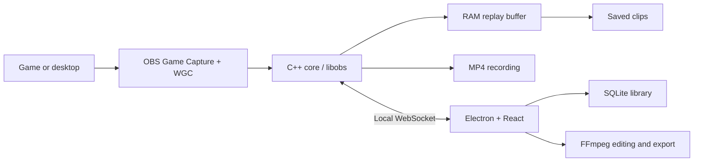

# Shard

**A local-first Windows game clipper built on OBS.**

Shard keeps recent gameplay in a RAM replay buffer so you can save the last few seconds or minutes with a hotkey. Browse your clips, trim and split them, choose your audio tracks, and export a file that fits your sharing limit.

> **Early development:** Shard uses extensive AI-assisted development. Bugs and rough edges are still expected. Bug reports and focused contributions are welcome.

[Download for Windows](https://github.com/Peppxrr/Shard/releases/latest) · [What's changed](CHANGELOG.md) · [Report a bug](https://github.com/Peppxrr/Shard/issues)

## Highlights

- **Replay and recording** — a duration- and memory-limited replay buffer, global save hotkeys, and manual or automatic recording.
- **Game-aware capture** — automatic game/desktop switching, desktop-only and game-only modes, launcher discovery, and session tracking across monitors. Authoring tools such as Unity Editor are excluded from automatic detection.
- **Hardware encoding** — detected NVIDIA, AMD, and Intel encoders, with CPU fallback when Auto cannot use hardware encoding.
- **Separate audio sources** — capture desktop, microphone, and application audio on independent tracks. Enable or disable a source without clearing the replay buffer.
- **Clip library** — search, sort, favorite, import, and drag clips into other apps. Storage cleanup respects protected clips.
- **Editor** — fast cached timeline previews, split/trim/delete, undo/redo, per-track audio controls, smooth seeking, and Ctrl+scroll zoom.
- **Size-limited exports** — hardware or CPU encoding, progress and cancellation, and automatic adjustment to fit the selected file-size limit.
- **Customizable interface** — themes, shortcuts, capture notifications, and clip-save sounds.
- **Manual updates** — check GitHub Releases in Settings → App, download when ready, then restart to install. Portable builds link to the release for manual replacement.

Windows is supported today. Platform-specific core code is isolated to make future Linux support possible.

## How it works



Game capture combines the official signed OBS graphics hook with Windows Graphics Capture. Games that continue rendering in the background can stay captured while unfocused or minimized. Compatibility depends on the game and its capture restrictions.

Shard uses its own verified OBS helper/hook files and Vulkan manifests. It does not replace OBS Studio's shared hook files or bypass anti-cheat.

## Build from source

### Requirements

- Windows 10 version 2004 or newer; Windows 11 recommended
- Visual Studio 2022 Build Tools with **Desktop development with C++**, MSVC v143, and Windows SDK **10.0.26100.0**
- CMake 3.28+, Git, Node.js 22+, and npm
- A Direct3D 11-capable GPU

### Clone and build

```powershell
git clone --recurse-submodules https://github.com/Peppxrr/Shard.git
cd Shard
powershell -File scripts/fetch-ffmpeg.ps1
powershell -File scripts/build.ps1
cd app
npm ci
npm run package
```

The build fetches pinned dependencies, applies the Shard OBS patch, creates the required directory junctions, and stages the core under `app/resources/core-bin/`. The official signed OBS injection payload is included in the repository and verified during building and packaging. Do not rebuild or re-sign those helper/hook files.

Installer and portable builds are written to `app/release/`. Generated runtimes, dependencies, and release binaries are not committed.

For an existing clone, initialize missing submodules with:

```powershell
git submodule update --init --recursive
```

## Development and tests

From the repository root:

```powershell
powershell -File scripts/dev.ps1           # Debug core + Electron + hot reload
powershell -File scripts/dev.ps1 -SkipCore # Reuse an existing Debug core
```

The development runtime is staged separately in `app/resources/core-bin-dev/`.

```powershell
npm --prefix app run verify                  # normal app changes
npm --prefix app run verify -- editor        # editor/export changes
npm --prefix app run verify -- updater       # updater changes
npm --prefix app run verify -- core          # C++ logic changes
npm --prefix app run verify -- capture       # capture/replay changes
```

Choose one relevant scope; do not run the whole list. [Verification](docs/VERIFYING.md) explains how to combine scopes, preview checks, and read the compact results. Full release verification runs in CI; local release builds use `npm --prefix app run verify -- release`. See [CONTRIBUTING.md](CONTRIBUTING.md) for the contribution workflow.

## Repository layout

| Folder | Contents |
| --- | --- |
| `app/src/main/` | Electron lifecycle, library, hotkeys, storage, and exports |
| `app/src/renderer/` | Capture, library, games, settings, viewer, and editor UI |
| `app/src/shared/` | Settings, RPC, events, and IPC contracts |
| `core/src/` | C++ capture engine, replay buffer, recording, and game detection |
| `core/tests/` | Core tests and capture fixtures |
| `scripts/` | Build, development, dependency setup, and verification |
| `patches/` | Reproducible changes to the pinned OBS source |
| `vendor/` | OBS submodule and verified official capture payload |

Custom CSS themes are documented in [docs/THEMES.md](docs/THEMES.md).
Versioning, release artifacts, GitHub Actions, and update testing are documented in [docs/RELEASING.md](docs/RELEASING.md).

## Data and privacy

Capture, indexing, editing, and export run locally. The core listens only on `127.0.0.1`. Settings and the game registry live in the app configuration directory; clip metadata uses a local SQLite database. Shard does not upload clips or telemetry.
Update checks and downloads contact GitHub only when requested in Settings. Nothing updates automatically at startup or on normal exit.

## Contributing and security

Contributions are welcome through pull requests. See [CONTRIBUTING.md](CONTRIBUTING.md). For private vulnerability reporting, see [SECURITY.md](SECURITY.md).

## License and attribution

Shard is licensed under **GNU GPL v2.0**; see [LICENSE](LICENSE) and [NOTICE](NOTICE). It incorporates modified OBS Studio components and is not affiliated with or endorsed by the OBS Project. The pinned OBS submodule, patches, and build workflow provide the corresponding source for those components.

Icons come from [Feather](https://github.com/feathericons/feather) (MIT) and [Lucide](https://github.com/lucide-icons/lucide) (ISC). Their complete licenses are included in the app. FFmpeg and other bundled dependencies retain their respective upstream licenses.
