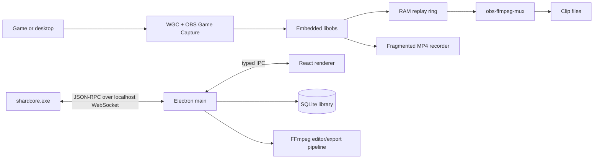

# Shard

> **Status:** Shard is in early development and uses extensive AI-assisted development. Bugs, rough edges, and UI issues are expected. Bug reports and focused contributions are welcome; contributors are responsible for reviewing and testing what they submit.

**A local-first Windows game clipper built on OBS.**

Shard keeps a rolling replay buffer in RAM, detects running games, and saves the last few seconds or minutes with a global hotkey. The Electron desktop app includes a searchable clip library, video viewer, non-destructive editor, multi-track audio controls, and target-size exports for services such as Discord.

Windows is the supported runtime today; the core keeps platform-specific capture code isolated for future Linux work.

**Current release:** [Shard v0.1.2](https://github.com/Peppxrr/Shard/releases/tag/v0.1.2) — Windows installer and portable build.

## Highlights

- **RAM replay buffer** — bounded by duration and memory, anchored to video keyframes, and written only when a clip is saved.
- **Automatic game detection** — Steam and other launcher discovery, process monitoring, known-game management, session tracking, and optional automatic recording.
- **Flexible capture** — automatic game/desktop switching, screen-only mode, or game-only mode.
- **Minimized-game resilience** — OBS Game Capture remains the primary game backend with Windows Graphics Capture as the non-injected fallback; temporary minimized-window outages keep the replay buffer intact and recover after restore.
- **Hardware encoding** — H.264 through NVENC when available with x264 fallback; NVENC AV1 is also supported.
- **Live independent audio tracks** — master mix plus per-source tracks for editing and export; sources can be enabled or disabled without clearing the replay buffer or splitting an active recording.
- **Crash-tolerant recording** — fragmented MP4 output avoids a separate remux step for normal recordings.
- **Clip library** — search, sorting, favorites/protection, thumbnails, import, deletion, storage limits, and drag-out to Explorer or Discord.
- **Editor and export** — custom playback controls, zoomable split/trim/delete timeline, per-stream cached waveforms, undo/redo, explicit multi-track audio controls, and target-size FFmpeg exports with real progress and cancellation.
- **Configurable hotkeys** — multiple replay durations with automatic re-registration after transient Windows shortcut failures.
- **Native storage picker** — choose a custom clips base folder with the operating system's folder dialog or return to the displayed default location.

## How it works



### Capture strategy

Shard layers two Windows capture backends for a detected game:

1. **OBS-compatible Game Capture** is the primary path. It uses the architecture-matched OBS helper and graphics hook when the application permits in-process capture, including games that continue rendering while minimized.
2. **Windows Graphics Capture** is the non-injected fallback for visible game windows. If neither backend can produce frames while a live game is minimized, Shard preserves the replay buffer, suppresses the expected minimized-window warning, and resumes WGC retries when the window is restored.

The compatibility path is validated with x64 D3D11, x64 D3D12, and x86 D3D11 targets. Current Shard and stock OBS both captured VRChat with EAC after a stale machine-wide OBS hook was replaced; the earlier trust/allowlisting conclusion is invalidated. The exact implementation, safety boundaries, test matrix, and evidence are documented in [`GAME_CAPTURE_AUDIT.md`](GAME_CAPTURE_AUDIT.md).

Shard does not bypass anti-cheat, install kernel components, or require reduced Windows security settings. Its target-side Game Capture payload is the exact official signed OBS Studio 32.2.1 release payload.

### OBS coexistence

Shard never injects from or writes `%ProgramData%\obs-studio-hook`. Game Capture uses only the pinned helper/hook binaries under Shard's staged `data/obs-plugins/win-capture` directory. Build-time and runtime checks enforce their SHA-256 hashes, valid Authenticode signatures, OBS signer identity, and signer-certificate thumbprints. Vulkan discovery uses uniquely named `shard-vulkan32/64.json` manifests and `VK_LAYER_SHARD_CAPTURE`; stock OBS retains exclusive ownership of its shared hook and manifests.

## Repository layout

```text
app/
  src/main/       Electron lifecycle, core client, hotkeys, library, storage, export
  src/renderer/   Capture, games, library, viewer, editor, and settings UI
  src/shared/     TypeScript settings, RPC, event, and hotkey contracts
core/
  src/            C++20 capture engine, replay ring, recorder, game system, JSON-RPC
  tests/          Detection tests and animated D3D11/D3D12 capture fixtures
patches/          Reproducible Shard patch applied to the pinned OBS checkout
scripts/          Build, development, selftest/E2E, and capture diagnostics
vendor/
  obs-studio/     Pinned OBS Studio 32.2.1 submodule
  obs-hook-payload/32.2.1/  Official signed OBS helper/hook binaries and integrity manifest
  ffmpeg/         Pinned FFmpeg runtime fetched locally; not committed
```

`app/src/shared/contracts.ts` is the cross-language contract. Changes to its RPC methods, events, or settings must be mirrored by the handlers in `core/src/jsonrpc.cpp`.

## Requirements

- Windows 10 version 2004 or newer; Windows 11 recommended
- Visual Studio 2022 Build Tools
  - Desktop development with C++
  - MSVC v143
  - Windows 11 SDK `10.0.26100.0`
- CMake 3.28 or newer
- Git with submodule support
- Node.js 22 or newer and npm
- A Direct3D 11-capable GPU

NVIDIA NVENC is optional. Shard falls back to x264 when a supported hardware encoder is unavailable.

## Clone and build

Clone with the OBS submodule:

```powershell
git clone --recurse-submodules <repository-url> Shard
cd Shard
```

If the repository was cloned without submodules:

```powershell
git submodule update --init --recursive
```

Fetch the pinned FFmpeg build:

```powershell
powershell -File scripts/fetch-ffmpeg.ps1
```

Build the C++ core, OBS plugins, compatibility helpers/hooks, and staged runtime:

```powershell
powershell -File scripts/build.ps1
```

The build script applies `patches/obs-game-capture.patch` idempotently to the pinned OBS checkout before compiling. Release runtime files are staged under `app/resources/core-bin/`.

Install and build the desktop app:

```powershell
cd app
npm install
npm run build
```

Create the installer and portable build:

```powershell
npm run package
```

Packaged artifacts are written under `app/release/`.

## Development

Run the integrated development workflow from the repository root:

```powershell
powershell -File scripts/dev.ps1
```

This uses the Debug core in `app/resources/core-bin-dev/`, starts the Vite renderer, watches Electron main-process TypeScript, and restarts Electron when required.

Useful build variants:

```powershell
powershell -File scripts/build.ps1 -SkipApp
powershell -File scripts/build.ps1 -Config Debug
powershell -File scripts/build.ps1 -Clean
```

## Verification

### Core selftest

Boot capture, warm the replay ring, save a short clip, and verify that muxing succeeds:

```powershell
$coreBin = (Resolve-Path app/resources/core-bin).Path
$out = Join-Path $env:TMP 'shard-selftest'
& "$coreBin/shardcore.exe" --selftest --out $out `
  --config-dir "$out/cfg" --core-bin $coreBin
```

Successful output contains one line beginning with:

```text
SELFTEST {"ok":true,...}
```

### JSON-RPC end-to-end test

```powershell
powershell -File scripts/e2e.ps1
$env:CF_LONG = '1'
powershell -File scripts/e2e.ps1 -KeepTemp
```

The short test exercises startup, settings, the replay ring, a 60-second save, ffprobe duration, capture-mode changes, audio enumeration, game persistence, events, and clean shutdown.

### Detection unit tests

```powershell
cmake --build build_x64 --config Debug --target shard_tests --parallel
build_x64\Debug\shard_tests.exe
```

### Game Capture compatibility test

```powershell
node scripts/game-capture-test.mjs
$env:CF_GC_API = 'D3D12'
node scripts/game-capture-test.mjs
```

The test verifies the packaged hashes and Authenticode signers, records focused, unfocused, covered, and genuinely minimized states, compares decoded frame hashes to detect frozen output, checks the selected app-owned hook path, and rejects overlapping or premature compatibility-helper launches. `CF_GC_EXPECT_BLOCK_STAGE=HookDllPayloadHash` exercises runtime fail-closed behavior against an intentionally corrupted staged copy.

## Runtime contract

`shardcore.exe` accepts:

```text
--config-dir <dir>   Required configuration directory
--core-bin <dir>     Staged OBS/runtime directory
--port <n>           JSON-RPC port; 0 selects a free port
--games <file>       Optional games.json path
--selftest           Run the capture/mux selftest
--out <dir>          Selftest output directory
```

For normal server startup, `PORT <n>` is always the first stdout line. Diagnostics are written to stderr so the Electron launcher can safely parse the port.

## Data and privacy

- Capture, indexing, editing, and export run locally.
- The core listens only on `127.0.0.1`.
- Settings and the game registry are stored in the app configuration directory.
- Clip metadata is stored in a local SQLite database.
- Shard does not upload clips or telemetry.

## Contributing and security

Contributions are welcome through pull requests. See [`CONTRIBUTING.md`](CONTRIBUTING.md) for the expected workflow and testing guidance.

Please avoid posting vulnerability details publicly before they can be investigated. See [`SECURITY.md`](SECURITY.md) for the security-reporting policy.

## License and attribution

Shard is licensed under **GNU GPL v2.0**. See [`LICENSE`](LICENSE).

Shard is an independent project built on and incorporating modified OBS Studio components. OBS Studio is Copyright (C) Lain Bailey and contributors and is distributed under the GNU General Public License. Shard is not affiliated with or endorsed by the OBS Project. Attribution and third-party notices are in [`NOTICE`](NOTICE).

The repository includes the pinned OBS source used by Shard together with the relevant patches/build workflow so that the corresponding source for distributed OBS-derived components remains available.

FFmpeg and other staged runtime components retain their respective upstream licenses.

UI icons are based on [Feather Icons](https://github.com/feathericons/feather) (MIT License, Copyright (c) 2013-2023 Cole Bemis).
