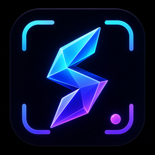
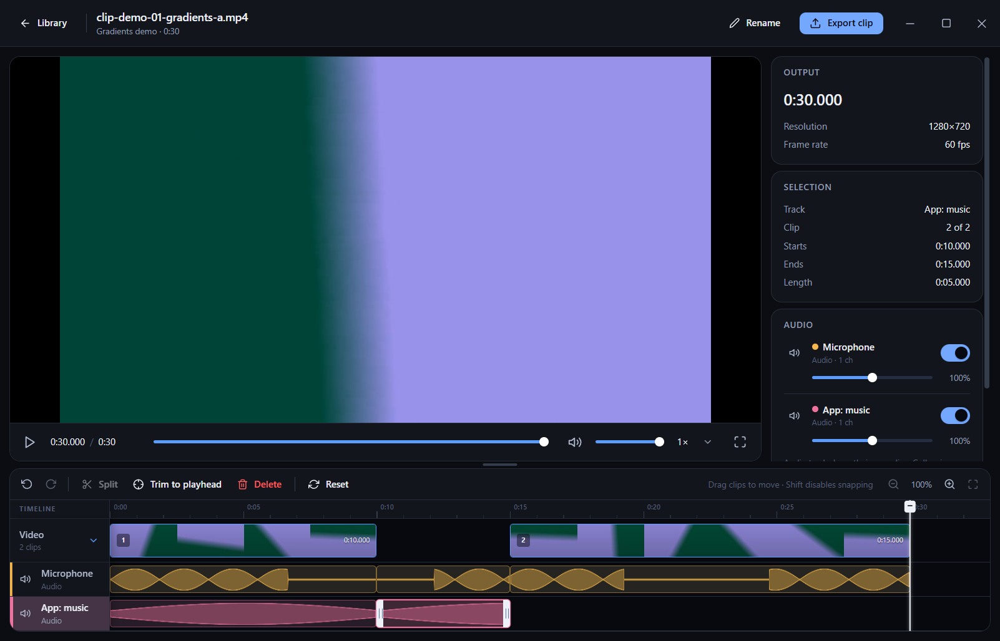
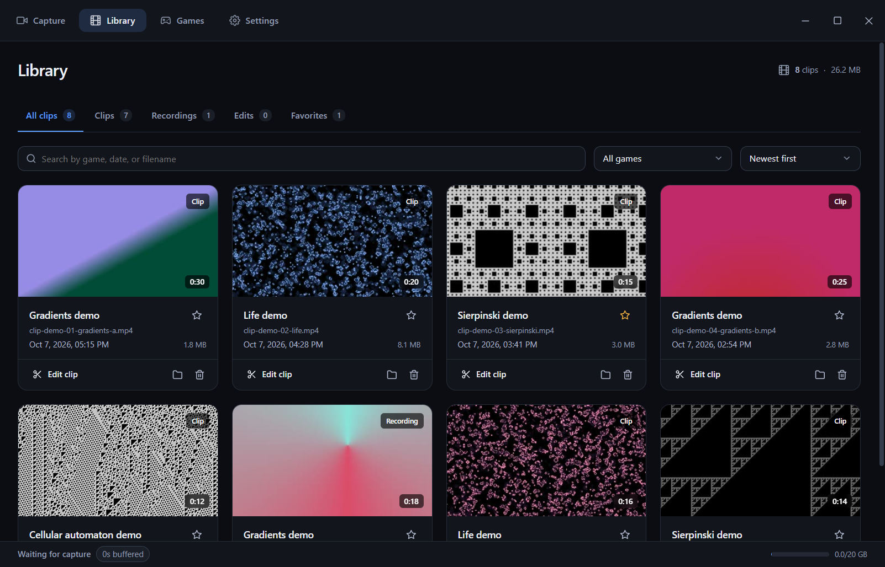
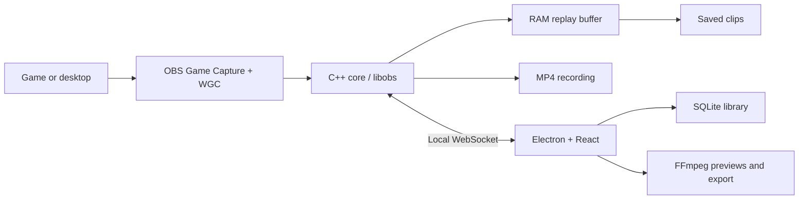

<p align="center">
  
</p>

<h1 align="center">Shard</h1>

<p align="center">
  <strong>Save the moment you just played.</strong><br>
  A local-first game clipper for Windows with an instant replay buffer, a real clip editor and size-limited exports.
</p>

> [!WARNING]
> Shard is developed with extensive AI assistance and is still early software. Expect bugs and rough edges, and please [report problems](https://github.com/Peppxrr/Shard/issues).

<p align="center">
  <a href="https://github.com/Peppxrr/Shard/releases/latest"></a>
  
  <a href="LICENSE"></a>
  <a href="CHANGELOG.md"></a>
</p>

<p align="center">
  <a href="https://github.com/Peppxrr/Shard/releases/latest"><b>Download for Windows</b></a> ·
  <a href="CHANGELOG.md">What's new</a> ·
  <a href="https://github.com/Peppxrr/Shard/issues">Report a bug</a>
</p>

<p align="center">
  
</p>

Shard keeps the last few minutes of gameplay in memory while you play. Press a hotkey and the moment is saved as a clip. Trim it, cut it up, mix its audio tracks, and export a file that fits Discord's upload limit — all on your own PC. There is no account, no cloud, and no telemetry.

It is built on OBS Studio's capture engine, including OBS's official signed Game Capture hook, and records with your GPU's hardware encoder when one is available.

## Features

**Instant replays**
- A RAM replay buffer (10 minutes / 2 GB by default) runs in the background. **F8** saves the last minute, **F9** the last five, **F10** starts or stops a full recording. Hotkeys and durations are configurable.
- Saves are confirmed with an on-screen overlay, a Windows notification or a short sound — your choice.

**Game capture that keeps working**
- Detects running games automatically (including launcher titles) and switches between game and desktop capture. Prefer one? Choose **Desktop** or **Game only**.
- Uses OBS's signed Game Capture hook first, with Windows Graphics Capture as a fallback. If a game's hook produces black or frozen frames, Shard switches to window capture and returns to the hook when it recovers.
- With several games open, capture follows the one you actually play — another game must keep focus for 5 seconds before Shard switches, and replay history is kept across switches.
- Games that keep rendering in the background stay captured while unfocused or minimized.

**Hardware encoding**
- Records with NVIDIA NVENC or AMD AMF (H.264, HEVC and AV1 where your GPU supports them), or x264/x265 on the CPU. **Auto** picks the best available encoder and falls back to the CPU when needed.
- Optional **Recording priority** (asks for administrator approval when you turn it on) raises the capture engine's GPU priority so recordings stay smooth while a game saturates the GPU.

**Audio on separate tracks**
- Desktop audio, microphones and individual applications are recorded on their own tracks.
- **Per-application isolation** keeps an app (for example Discord or Spotify) off the Desktop track so it only exists on its own track.

**A library that stays tidy**
- Search, sort and filter clips, recordings and edits; star favorites; rename files; drag clips straight into Discord or a browser upload.
- **Smart storage cleanup** removes the oldest ordinary clips once you pass your limit (20 GB by default). Favorites, recordings, very large videos, clips from the last 24 hours and the five newest clips are always kept, and unusually large cleanups wait for your confirmation.
- Import existing clips and editor exports from Medal.

**An editor built for clips**
- Move, trim and split clips on a real timeline. **S** splits every track at the playhead, **Shift+S** only the selected clip. Edges snap to other clips and the playhead.
- Leave gaps on purpose: empty time plays and exports as black video and silence.
- Audio stays linked to the video until you separate it. Separated tracks can be trimmed, moved and split on their own, and **Relink audio to video** puts them back.
- Per-track mute and volume, undo/redo, zoom, and waveforms and timeline previews that are cached so reopening a clip is fast.

**Exports that fit**
- Set a size limit (10 MB by default) and a resolution. Shard encodes for quality first, then lowers the bitrate or resolution only when the file would exceed the limit.
- Encodes with NVENC, AMF, Intel Quick Sync, x264, x265 or SVT-AV1. With the **Auto** encoder it falls back to x264 if a hardware encoder fails. Progress shows on the player, and exports can be cancelled.

**Make it yours**
- Built-in Default, OLED and Midnight themes, plus custom CSS themes with their own settings. See the [theme guide](docs/THEMES.md).
- Updates are checked at startup and every 12 hours. Nothing downloads until you click, and you can install right away or on the next launch.

<p align="center">
  
</p>
<p align="center"><sub>Screenshots of Shard 0.1.10 with generated demo clips.</sub></p>

## Install

1. Download **`Shard-Setup-<version>.exe`** from the [latest release](https://github.com/Peppxrr/Shard/releases/latest). It installs for your user account only and needs no administrator rights.
   Prefer not to install? **`Shard-<version>-portable.exe`** runs from any folder.
2. Shard is not code-signed yet, so Windows SmartScreen may warn on first launch. Choose **More info → Run anyway** if you downloaded it from this repository's releases page.
3. Shard starts capturing right away. Play something, press **F8**, and open **Library** to see your clip.

**Requirements:** 64-bit Windows 10 or Windows 11 and a Direct3D 11 GPU. An NVIDIA or AMD GPU with a hardware encoder is recommended; other systems record on the CPU.

Settings, the library and your clips live in `%APPDATA%\Shard` unless you choose another clips folder, and they are kept when Shard updates.

## Privacy

Shard is local-first:

- Capture, the library, editing and exports run entirely on your PC. Clips are never uploaded.
- There is no account, analytics or telemetry.
- The capture engine only accepts connections from Shard on `127.0.0.1`.
- Network access is limited to update checks against GitHub Releases (at startup and every 12 hours; downloads only when you ask) and the Game Capture compatibility list that the embedded OBS capture plugin refreshes from obsproject.com.

## Status and limitations

Shard is young (0.1.x) and under active development; expect rough edges and please [report bugs](https://github.com/Peppxrr/Shard/issues).

- Windows only. The interface is in English.
- Some games block capture hooks, often because of anti-cheat. Shard uses window capture for those where Windows allows it, and never tries to bypass anti-cheat.
- Intel Quick Sync is available for exports; recording on Intel-only systems uses the CPU encoders.
- Builds are not code-signed yet (see [Releasing](docs/RELEASING.md#signing)).

## How it works


```mermaid
flowchart LR
    Game[Game or desktop] --> Capture[OBS Game Capture + WGC]
    Capture --> Core[C++ core / libobs]
    Core --> Ring[RAM replay buffer]
    Core --> Recording[MP4 recording]
    Ring --> Clips[Saved clips]
    Core <-->|Local WebSocket| App[Electron + React]
    App --> Library[SQLite library]
    App --> Export[FFmpeg previews and export]
```

A C++20 core embeds OBS's libobs for capture, encoding, the replay buffer, recording and game detection, and serves a JSON-RPC WebSocket on `127.0.0.1`. An Electron + React app owns the interface, library, editor, exports, hotkeys, themes and updates. Shard ships the official signed OBS hook and helper files with its own uniquely named Vulkan manifests, verifies their hashes and signatures during every build, and does not replace OBS Studio's shared hook files. See [Architecture](docs/ARCHITECTURE.md) and [Capture](docs/CAPTURE.md) for details.

## Build from source

Requirements: Windows 10 2004+ (Windows 11 recommended), Visual Studio 2022 Build Tools with **Desktop development with C++**, MSVC v143 and Windows SDK **10.0.26100.0**, CMake 3.28+, Git, Node.js 22+ and npm.

```powershell
git clone --recurse-submodules https://github.com/Peppxrr/Shard.git
cd Shard
powershell -File scripts/fetch-ffmpeg.ps1
powershell -File scripts/build.ps1
cd app
npm ci
npm run package
```

The build applies Shard's OBS patch, stages the core and its runtime under `app/resources/core-bin/`, and verifies the pinned FFmpeg download and the official OBS payload. Do not rebuild or re-sign the OBS hook/helper files. Installer and portable builds are written to `app/release/`; `npm run size-report` breaks down their size. In an existing clone, run `git submodule update --init --recursive` first.

## Development

```powershell
powershell -File scripts/dev.ps1            # Debug core + Electron with hot reload
powershell -File scripts/dev.ps1 -SkipCore  # reuse an existing Debug core
npm --prefix app run verify                 # app checks; add a scope such as -- editor or -- capture
```

[Verification](docs/VERIFYING.md) explains which scope to run for a change. The repository is organized as:

| Folder | Contents |
| --- | --- |
| `app/src/main/` | Electron main process: core lifecycle, library, storage, hotkeys, editor media, exports, updates |
| `app/src/renderer/` | React interface: capture, library, games, settings, viewer and editor |
| `app/src/shared/` | Settings, RPC, event and IPC contracts shared with the core |
| `core/src/`, `core/tests/` | C++ capture engine, replay buffer, recording, game detection and their tests |
| `scripts/`, `patches/`, `vendor/` | Build/verification scripts, the Shard OBS patch, the pinned OBS submodule and official capture payload |

## Contributing and security

Pull requests are welcome — see [CONTRIBUTING.md](CONTRIBUTING.md). Report vulnerabilities privately as described in [SECURITY.md](SECURITY.md). Shard is developed with extensive AI assistance; changes are reviewed and verified with the checks described in [Verification](docs/VERIFYING.md).

## License

Shard is licensed under the **GNU GPL v2.0**; see [LICENSE](LICENSE) and [NOTICE](NOTICE). It includes modified OBS Studio components and is not affiliated with or endorsed by the OBS Project; the pinned OBS submodule, patches and build scripts provide their corresponding source. The bundled FFmpeg tools are an unmodified GPL v3 build whose license ships alongside them. Icons come from [Feather](https://github.com/feathericons/feather) (MIT) and [Lucide](https://github.com/lucide-icons/lucide) (ISC).
